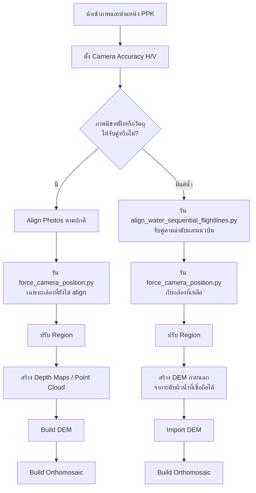

# Metashape Water Orthomosaic

แนวทางประมวลผลภาพถ่ายโดรนเพื่อสร้าง orthomosaic ในพื้นที่น้ำด้วย
Agisoft Metashape Professional โดยรองรับ 2 กรณีหลัก:

1. **มีชายฝั่งหรือวัตถุที่มองเห็นได้** — ใช้การ Align Photos ตามปกติ แล้วใช้
   ตำแหน่ง PPK/RTK ช่วยเฉพาะภาพที่ไม่สามารถ align ได้
2. **มีแต่น้ำหรือมี texture ต่ำมาก** — จับคู่ภาพตามลำดับการถ่ายและแนวบินก่อน
   แล้วใช้ตำแหน่ง PPK/RTK และ DEM ภายนอกช่วยสร้าง orthomosaic ให้ครอบคลุมพื้นที่

> [!IMPORTANT]
> ถ้าความแม่นยำ PPK คือแนวราบ **2 cm** และแนวดิ่ง **5 cm** ให้ป้อนใน
> Metashape เป็น `0.02 m` และ `0.05 m` ตามลำดับ ภาพ workflow เดิมที่เขียน
> `0.02/0.05 cm` น่าจะระบุหน่วยคลาดเคลื่อน จึงควรตรวจสอบรายงาน PPK ก่อนใช้จริง

## Workflow



รายละเอียดทีละขั้นอยู่ใน [คู่มือการประมวลผล](docs/WORKFLOW_TH.md)
และรูปแบบข้อมูล PPK อยู่ใน [คู่มือข้อมูลอ้างอิง](docs/REFERENCE_DATA_TH.md)

## โครงสร้าง repository

```text
.
├── Py/
│   ├── align_water_sequential_flightlines.py
│   │                             # จับคู่/align ตามลำดับในแต่ละแนวบิน
│   ├── force_camera_position.py  # กำหนด transform จากตำแหน่งและมุมอ้างอิง
│   └── README.md
├── Data/
│   └── README.md                 # อธิบายข้อมูลตัวอย่าง (ข้อมูลจริงไม่ถูก commit)
├── docs/
│   ├── WORKFLOW_TH.md
│   ├── REFERENCE_DATA_TH.md
│   └── TROUBLESHOOTING_TH.md
├── tools/
│   └── validate_reference_csv.py
└── .github/workflows/python-syntax.yml
```

## เริ่มใช้งาน

1. เปิดโครงการใน Agisoft Metashape Professional 2.x และเพิ่มภาพถ่าย
2. นำเข้าไฟล์ PPK ใน Reference pane โดยให้ชื่อภาพตรงกับ camera label
3. ตรวจ CRS, vertical datum, camera accuracy และชนิดมุม Yaw/Pitch/Roll
4. เลือก workflow ให้ตรงกับลักษณะพื้นที่
5. รันสคริปต์ผ่าน `Tools > Run Script` หรือ Python Console ของ Metashape
6. บันทึกสำเนาโครงการก่อนรันสคริปต์ โดยเฉพาะ
   `Py/align_water_sequential_flightlines.py`
7. ตรวจ alignment, camera error, DEM และ seamline ก่อน export GeoTIFF

สคริปต์ต้องรันภายใน Python ของ Metashape เพราะต้องใช้โมดูล `Metashape` และ
เอกสารต้องมี active chunk

## ตรวจไฟล์ PPK ก่อนนำเข้า

ใช้ Python ปกตินอก Metashape ได้:

```powershell
python tools/validate_reference_csv.py Data/K_AreaC/Area_C.csv Data/T_AreaE/Area_E.csv
```

ตัวตรวจจะรายงานจำนวนแถว แบนด์ ช่วงพิกัด ค่าที่อ่านไม่ได้ ชื่อภาพซ้ำ และค่าพิกัด
ที่ผิดช่วงเบื้องต้น แต่ไม่สามารถยืนยัน datum หรือความถูกต้องเชิงสำรวจแทนผู้ใช้ได้

## ข้อจำกัด

- ผิวน้ำเปลี่ยนรูปร่าง สะท้อนแสง และมีคลื่น จึงมักสร้าง tie points ที่ไม่เสถียร
- `force_camera_position.py` เป็น fallback จาก GPS/INS ไม่ใช่ผล bundle adjustment
- DEM ภายนอกต้องครอบคลุมพื้นที่ orthomosaic และใช้ CRS/vertical datum ที่สอดคล้องกัน
- ห้ามใช้ค่าความสูงของกล้องใน CSV เป็นระดับผิวน้ำ
- ควรมี check points หรือข้อมูลสำรวจอิสระสำหรับประเมินความถูกต้อง

คู่มือนี้อ้างอิง workflow ของ Agisoft Metashape Professional 2.x และตรวจชื่อ API
กับเอกสารรุ่น 2.3.2 แต่ยังต้องทดสอบกับข้อมูลและรุ่น Metashape ที่ใช้งานจริง

## เอกสารอ้างอิง

- [Agisoft Metashape Professional User Manual](https://www.agisoft.com/pdf/metashape-pro_2_3_en.pdf)
- [Agisoft Metashape Python API Reference](https://www.agisoft.com/pdf/metashape_python_api_2_3_2.pdf)
- [Agisoft official Metashape scripts](https://github.com/agisoft-llc/metashape-scripts)
