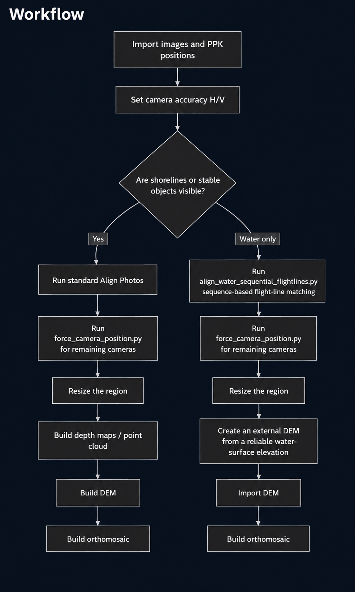
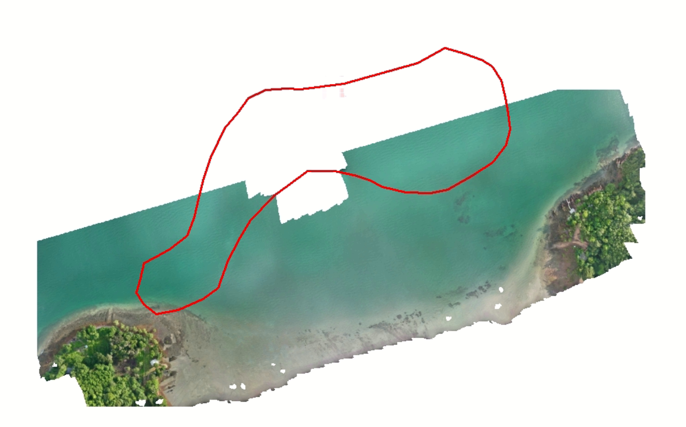
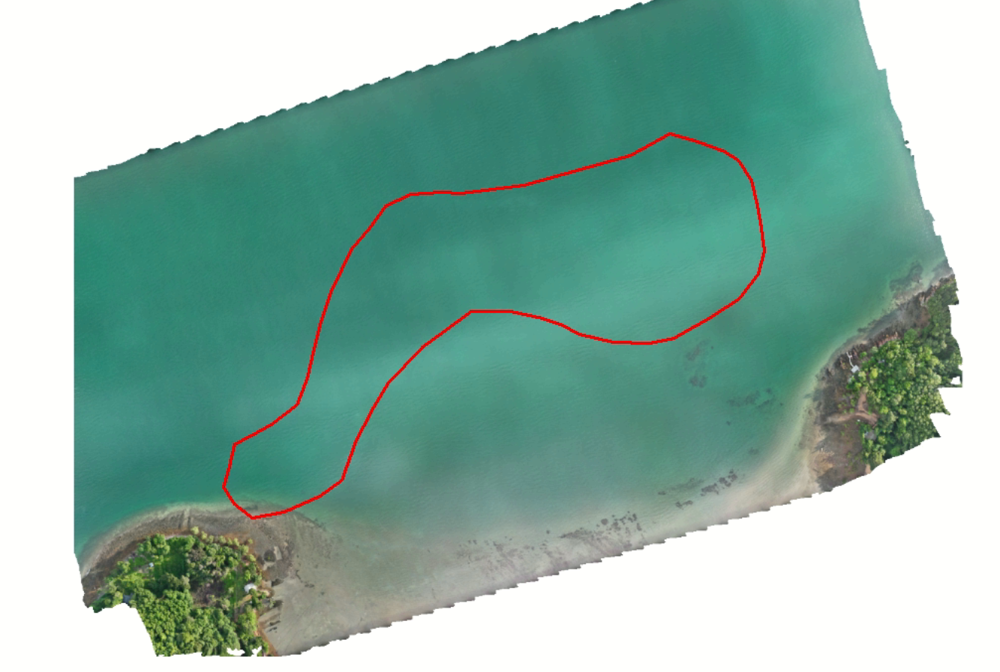
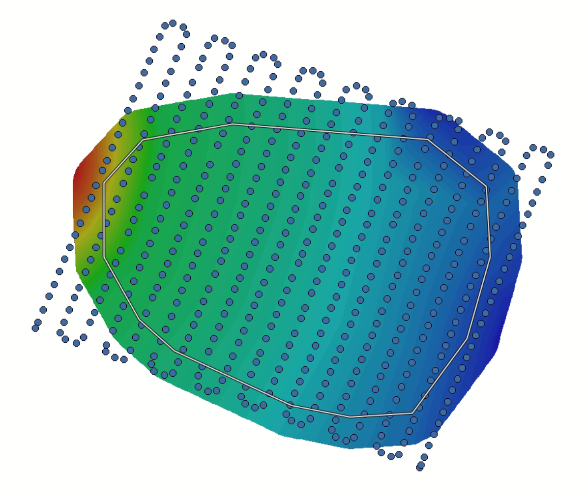
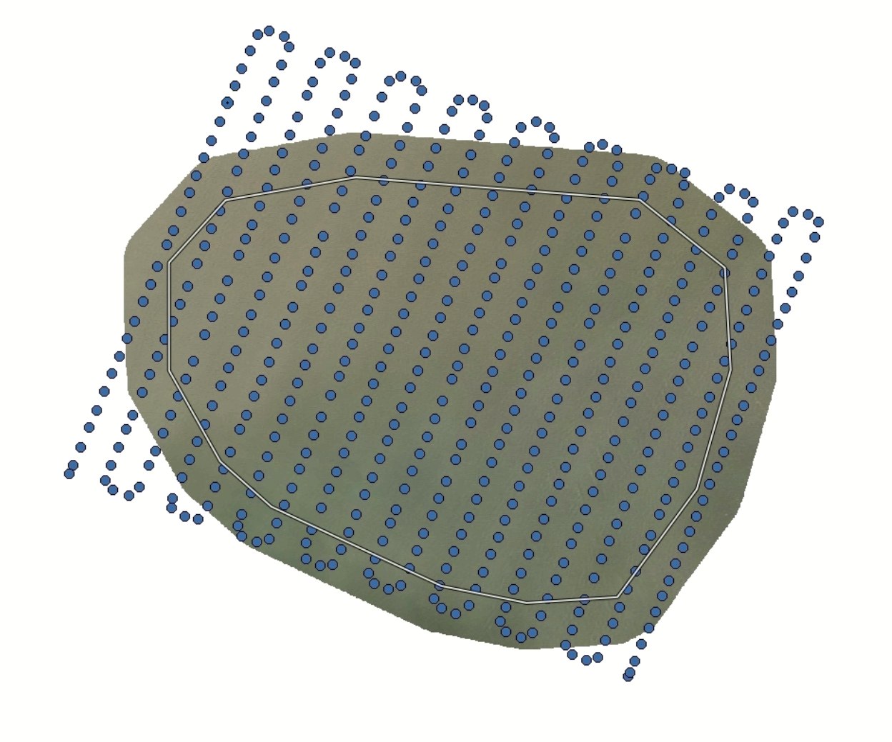
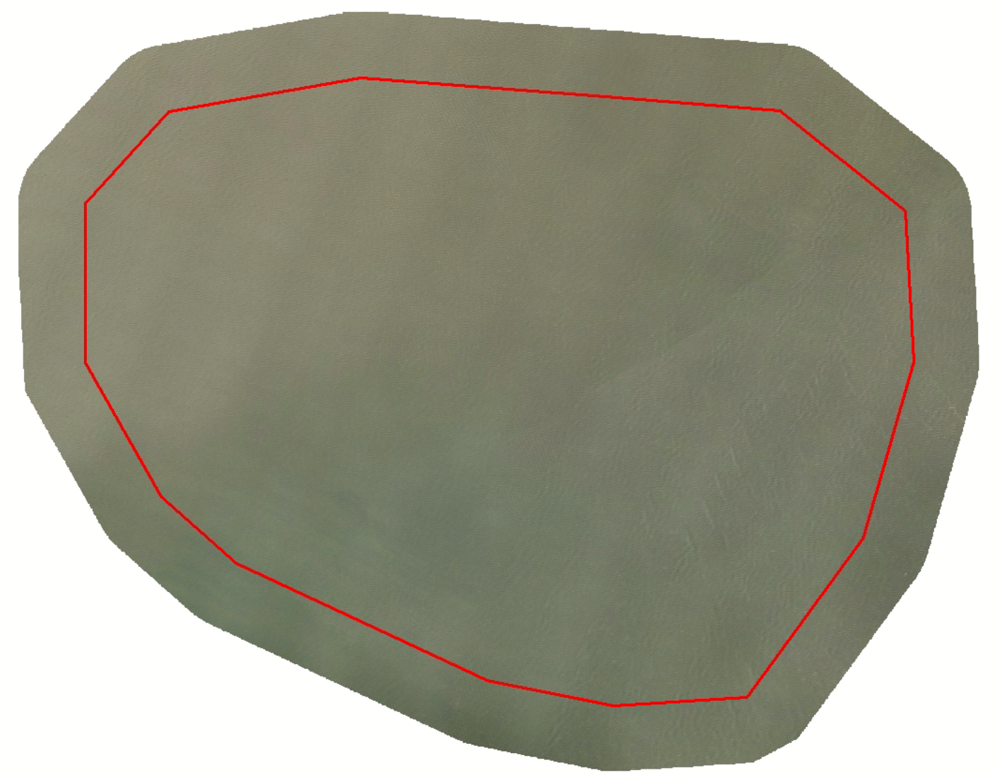

# Metashape Water Orthomosaic

A practical workflow for producing drone orthomosaics over water in Agisoft
Metashape Professional. The repository covers two processing scenarios:

1. **A shoreline or visible objects are present** — use standard photo alignment,
   then use PPK/RTK positions only for cameras that could not be aligned.
2. **The area contains only water or extremely low texture** — match cameras by
   capture sequence and flight line, then use PPK/RTK positions and an external
   DEM to produce complete orthomosaic coverage.

> [!IMPORTANT]
> If the PPK accuracy is **2 cm horizontally** and **5 cm vertically**, enter
> `0.02 m` and `0.05 m` in Metashape. The original workflow diagram labels these
> values as `0.02/0.05 cm`, which is likely a unit error. Confirm the units in the
> PPK processing report before use.

## Workflow



## Example results

### Scenario 1 — Shoreline and stable features available

The Area C example shows the orthomosaic before and after recovering coverage over the
low-texture water area. The red line marks the survey or processing boundary.

| Before | After |
|---|---|
|  |  |

### Scenario 2 — Water-only area

The Area E example uses camera positions and an external elevation surface to support
orthomosaic generation where stable image texture is limited.

**DEM and camera positions**



**Orthomosaic and camera positions**



**Final orthomosaic**



See the [processing workflow](docs/WORKFLOW.md),
[reference-data guide](docs/REFERENCE_DATA.md), and
[troubleshooting guide](docs/TROUBLESHOOTING.md) for detailed instructions.

## Repository structure

```text
.
├── Py/
│   ├── align_water_sequential_flightlines.py
│   │                             # Match and align sequential cameras by flight line
│   ├── force_camera_position.py  # Set transforms from reference position/orientation
│   └── README.md
├── Data/
│   └── README.md                 # Data description; real survey data is not committed
├── docs/
│   ├── WORKFLOW.md
│   ├── REFERENCE_DATA.md
│   ├── TROUBLESHOOTING.md
│   └── images/                    # Example processing results
├── tools/
│   └── validate_reference_csv.py
└── .github/workflows/python-syntax.yml
```

## Quick start

1. Open a project in Agisoft Metashape Professional 2.x and add the photographs.
2. Import the PPK file in the Reference pane. Image names must match camera labels.
3. Verify the CRS, vertical datum, camera accuracy, and angle convention.
4. Select the workflow that matches the scene.
5. Run scripts through `Tools > Run Script` or the Metashape Python Console.
6. Save a project copy before running a script, especially
   `Py/align_water_sequential_flightlines.py`.
7. Inspect alignment, camera errors, the DEM, and seamlines before exporting GeoTIFF.

The scripts must run in Metashape's Python environment because they require the
`Metashape` module and an open document with an active chunk.

## Validate PPK reference files

The CSV validator runs in a standard Python installation outside Metashape:

```powershell
python tools/validate_reference_csv.py Data/K_AreaC/Area_C.csv Data/T_AreaE/Area_E.csv
```

It reports row and band counts, coordinate ranges, malformed values, duplicate image
names, and basic coordinate-range errors. It cannot validate the survey datum or
replace an independent accuracy assessment.

## Limitations

- Water changes shape, reflects light, and moves between exposures, so tie points may
  be unstable.
- `force_camera_position.py` is a GPS/INS fallback, not a bundle-adjusted solution.
- An external DEM must cover the orthomosaic extent and use compatible horizontal and
  vertical reference systems.
- Never use the camera elevation from the reference CSV as the water-surface elevation.
- Independent checkpoints or survey observations are recommended for accuracy testing.

The workflow targets Agisoft Metashape Professional 2.x. API names were reviewed
against the 2.3.2 documentation, but processing must still be tested with the actual
dataset and installed Metashape version.

## References

- [Agisoft Metashape Professional User Manual](https://www.agisoft.com/pdf/metashape-pro_2_3_en.pdf)
- [Agisoft Metashape Python API Reference](https://www.agisoft.com/pdf/metashape_python_api_2_3_2.pdf)
- [Official Agisoft Metashape scripts](https://github.com/agisoft-llc/metashape-scripts)
